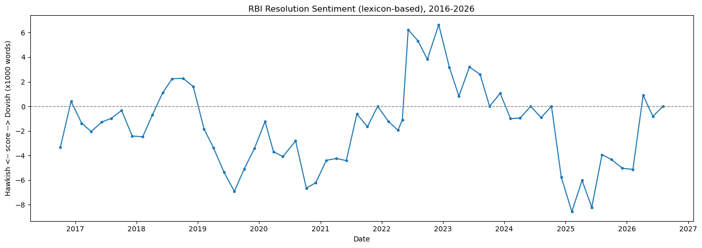

# RBI Monetary Policy Communication: NLP-Based Sentiment & Market Forecasting

Does the *tone* of RBI's Monetary Policy Committee communication carry information about bond yields and the rupee, beyond what the interest rate decision itself already tells markets? This project builds an end-to-end pipeline -- web scraping, NLP sentiment scoring, and econometric validation -- to answer that question directly from ten years of RBI's own words.

**[Read the full report (PDF)](reports/RBI_Sentiment_Project_Report.pdf)**

---

## Key Results

- **163 RBI documents** (61 Resolutions, 60 Minutes, 42 Governor's Statements), October 2016 - August 2026, scraped, cleaned, and scored for hawkish/dovish sentiment using two independent methods.
- **No significant average effect** of sentiment on short-window G-Sec yield or USD/INR moves once the repo rate decision is controlled for -- confirmed independently by OLS, ARIMA-residual analysis, and Granger causality.
- **But a real, targeted signal**: out-of-sample directional accuracy of **69% (p = 0.031)** in the 3-day window -- sentiment correctly calls the direction of the following yield move significantly more often than chance, on data the model never saw during fitting.
- **A concrete case study finding**: during the 2022 inflation shock, the 10-year yield moved nearly as much on a meeting where RBI **held rates but shifted tone** as it did on the actual emergency hike three weeks later -- and the primary sentiment score initially missed that shift, revealing a specific, explainable limitation of lexicon-based scoring.



---

## Repository Structure

```
rbi-sentiment-market-forecast/
├── data/
│   ├── raw/           # scraped HTML + PDF documents, document index (gitignored -- regenerable)
│   ├── processed/     # cleaned text corpus, sentiment scores, merged dataset
│   └── market/        # G-Sec yield, USD/INR, repo rate history
├── notebooks/         # one notebook per pipeline stage, 01 through 08
├── src/                # importable Python modules the notebooks call into
├── reports/
│   ├── figures/        # saved chart outputs
│   └── RBI_Sentiment_Project_Report.pdf
├── requirements.txt
└── README.md
```

## Pipeline

| # | Notebook | What it does |
|---|---|---|
| 01 | `01_scraping.ipynb` | Scrapes RBI's policy archive (reverse-engineered its non-standard year-selection mechanism), downloads all documents, pulls USD/INR via `yfinance` |
| 02 | `02_text_cleaning.ipynb` | Extracts and cleans text from PDFs (primary source) and HTML (fallback for 5 documents with mismatched PDFs), builds the master text dataset |
| 03 | `03_sentiment_scoring.ipynb` | Dictionary-based hawkish/dovish lexicon scoring |
| 04 | `04_finbert_scoring.ipynb` | Sentence-level FinBERT scoring, aggregated to document level |
| 05 | `05_merging.ipynb` | Trading-day event windows around each Resolution; repo-rate change extracted directly from resolution text |
| 06 | `06_econometrics.ipynb` | ADF stationarity tests, OLS regression, ARIMA-residual check, Granger causality |
| 07 | `07_out_of_sample.ipynb` | Chronological train/test split (train: pre-2022, test: 2022 onward), out-of-sample R² and directional accuracy |
| 08 | `08_case_study_2022.ipynb` | Focused timeline of the 2022 inflation shock episode |

## Data Sources

| Source | Content |
|---|---|
| [rbi.org.in](https://www.rbi.org.in) | MPC Resolutions, Minutes, Governor's Statements |
| `yfinance` (`INR=X`) | USD/INR daily close |
| [investing.com](https://in.investing.com) | 10-year G-Sec daily yield |

## Methodology Summary

**Sentiment scoring** uses two independent approaches: a hand-built ~50-phrase hawkish/dovish financial lexicon (validated against known events -- e.g. the September 2022 50bps-hike Resolution scores +3.82, pandemic-era 2021 Resolutions score around -4.3), and sentence-level [FinBERT](https://huggingface.co/ProsusAI/finbert) aggregated to the document level. The two scores correlate at 0.29 -- real but modest, since FinBERT responds to general economic-news sentiment rather than the hawkish/dovish policy-stance axis specifically.

**Market data** is aligned to each Resolution using trading-day (not calendar-day) event windows, robust to weekends and holidays. A repo-rate-change control is extracted directly from each Resolution's own text and validated against six independently known historical events (the 2018 hiking cycle, 2019 cutting cycle, the March 2020 emergency COVID cut, and the 2022 hiking cycle).

**Validation** follows three independent tracks -- full-sample OLS with diagnostics, an ARIMA-residual check, and Granger causality -- plus a chronological out-of-sample split evaluating both R² and directional accuracy. Full detail, all coefficients, and the literature comparison are in the [report](reports/RBI_Sentiment_Project_Report.pdf).

## Reproducing This

```bash
python -m venv .venv
source .venv/bin/activate          # Windows: .venv\Scripts\activate
pip install -r requirements.txt
python -m spacy download en_core_web_sm
```

Run the notebooks in order, 01 through 08. Two manual downloads are required before Phase 4 (documented in the notebooks): the 10-year G-Sec yield series from investing.com, and (optionally, not used in the current results) a CPI-surprise series hand-built from MOSPI actuals.

## Limitations

- Sample size (61 Resolutions, 29 out-of-sample observations) limits statistical power -- results should be read as directional evidence, not definitive proof.
- 3 of 163 documents (RBI's earliest MPC-era statements, April-August 2016) retain some residual text-extraction noise from an older page template; both fall in the training period and don't affect the primary results.
- CPI surprise was planned as a control variable but not built; the repo-rate-change control was used in its place.
- The lexicon is a manually constructed dictionary, not a validated published instrument -- the case study documents a specific instance where it missed a real tone shift.

Full discussion in the [report](reports/RBI_Sentiment_Project_Report.pdf).

## Tech Stack

Python · pandas · BeautifulSoup · pdfplumber · spaCy · Hugging Face Transformers (FinBERT) · statsmodels · matplotlib

---

*M.Sc. Economics, IIT Kanpur -- Placement Portfolio Project*
